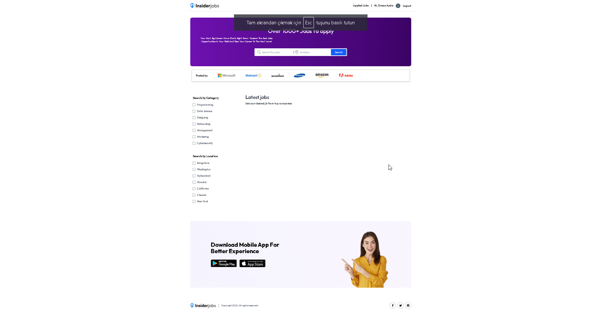

# Job Portal

## Proje Açıklaması

Job Portal, iş arayanlar ve işverenler için bir platformdur. Kullanıcılar iş ilanlarını görüntüleyebilir, başvuruda bulunabilir ve işverenler iş ilanları oluşturabilir.

## Kullanılan Teknolojiler

- **React**: İstemci tarafı için kullanıcı arayüzü oluşturmak için.
- **Node.js**: Sunucu tarafı uygulaması için.
- **Express**: Sunucu tarafında RESTful API oluşturmak için.
- **MongoDB**: Veri saklama için.
- **Vite**: İstemci tarafı uygulaması için geliştirme aracı.
- **ESLint**: Kod kalitesini sağlamak için.

## Proje İçeriğinde Yapılan İşlemler

- Kullanıcılar iş ilanlarını görüntüleyebilir ve başvuruda bulunabilir.
- İşverenler yeni iş ilanları oluşturabilir.
- Kullanıcılar giriş yapabilir ve profillerini yönetebilir.
- Webhook'lar ile üçüncü parti entegrasyonlar sağlanabilir.

## Kurulum

1. Projeyi klonlayın:
   ```bash
   git clone <repository-url>
   ```
2. İstemci bağımlılıklarını yükleyin:
   ```bash
   cd client
   npm install
   ```
3. Sunucu bağımlılıklarını yükleyin:
   ```bash
   cd server
   npm install
   ```

## Kullanım

1. Sunucuyu başlatın:
   ```bash
   cd server
   node server.js
   ```
2. İstemciyi başlatın:
   ```bash
   cd client
   npm start
   ```

## Yapılandırma

Proje yapılandırmaları için `.env` dosyasını düzenleyin.

## Katkıda Bulunma

Katkıda bulunmak için lütfen bir pull request oluşturun.

## Lisans

Bu proje MIT lisansı altında lisanslanmıştır.

## Canlı Demo

Projenin canlı versiyonuna buradan ulaşabilirsiniz: [Job Portal](https://job-portal-client-wheat-three.vercel.app/)


